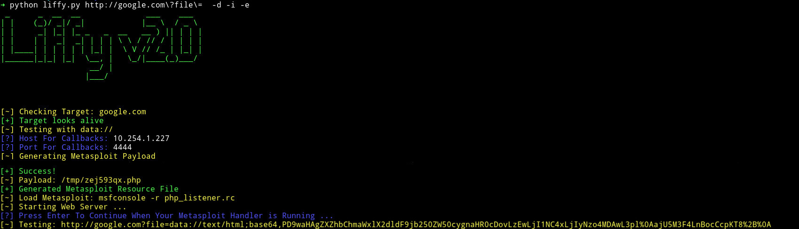

<h1 align="center">
   
  
   
</h1>

<h4 align="center">LFI Exploitation tool</h4>

  <a href="https://github.com/mzfr/liffy/wiki">liffy Wiki</a> •
  <a href="https://github.com/mzfr/liffy/wiki/Usage">Usage</a> •
  <a href="https://github.com/mzfr/liffy/wiki/Installation">Installation</a> •

A little python tool to perform Local file inclusion.

Liffy v2.0 is the improved version of [liffy](https://github.com/hvqzao/liffy) which was originally created by [rotlogix/liffy](https://github.com/rotlogix/liffy). The latter is no longer available and the former didn't had any movement from long time.

## Main feature

  - data:// for code execution
  - expect:// for code execution
  - input:// for code execution
  - filter:// for arbitrary file reads
  - /proc/self/environ for code execution in CGI mode
  - Apache access.log poisoning
  - Linux auth.log SSH poisoning
  - Direct payload delivery with no stager
  - Support for absolute and relative path traversal
  - Support for cookies for authentication

## Documentation

* [Installation](https://github.com/mzfr/liffy/wiki/Installation)
* [Usage](https://github.com/mzfr/liffy/wiki/Usage)

## Contribution

* Suggest a feature
  - Like any other technique to exploit LFI

* Report a bug
* Fix something and open a pull request

In any case feel free to open an issue

## Credits

All the exploitation techniques are taken from [liffy](https://github.com/hvqzao/liffy)

## Say Thanks

If you'd like to :tada: [say thanks](https://saythanks.io/to/mzfr) :smile:

